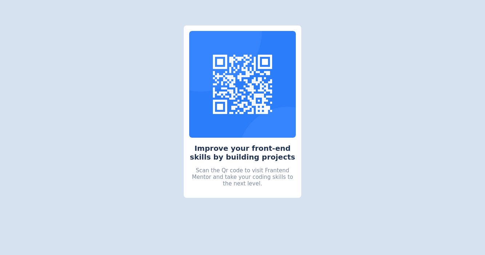

# Frontend Mentor - QR code component solution

This is a solution to the [QR code component challenge on Frontend Mentor](https://www.frontendmentor.io/challenges/qr-code-component-iux_sIO_H). Frontend Mentor challenges help you improve your coding skills by building realistic projects. 

## Table of contents

- [Overview](#overview)
  - [Screenshot](#screenshot)
  - [Links](#links)
  - [Built with](#built-with)
  - [What I learned](#what-i-learned)
  - [Continued development](#continued-development)
  - [Useful resources](#useful-resources)
- [Author](#author)

## Overview

### Screenshot

### Links

- Solution URL: [here](https://github.com/zakariae111/qr-code-component-main)
- Live Site URL: [here]( https://zakariae111.github.io/qr-code-component-main/)

### Built with

- Semantic HTML5 markup
- CSS custom properties
- Flexbox

### What I learned

Actualy I'bve learned a lot from this project : how to use variables in css ,flex box ,also i've got more informations about RWD (Resposive web).

### Continued development

welcome to all feedback 
if there any optimations or other way to make my code more optmized and more organized ,readable
you can tell me'

I think that's the way that would help us to understand more
thanks (:

### Useful resources

- [CSS Media Query Range Syntax ](https://css-tricks.com/the-new-css-media-query-range-syntax/) - This helped me in resposive design. I really liked this pattern and will use it going forward.
- [flex in css](https://www.w3schools.com/cssref/css3_pr_flex.php) - This is an amazing article which helped me finally understand the flex box in css. I'd recommend it to anyone still learning this concept.

## Author

- Frontend Mentor - [@zakariae111](https://www.frontendmentor.io/profile/zakariae111)
